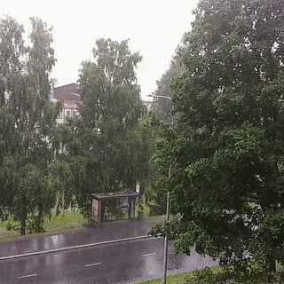
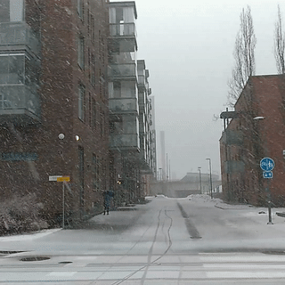

# VARG: An Intensity-labelled Video Weather Recognition Dataset 

## Overview

We provide the implementation used for the evaluation of VARG dataset. We used the several deep learning based video classificatin models as backbone and implemented custom classification head.

## Content

- [Prerequisites](#prerequisites)
- [Data Preparation](#data-preparation)
- [Pretrained Weather Classification Models](#pretrained-models)
- [Training](#training)
- [Testing](#testing)

## Prerequisites

The code is built with following libraries:

- [PyTorch](https://pytorch.org/) 1.13 or higher
- [OpenCV](https://opencv.org/)
- [TensorboardX](https://github.com/lanpa/tensorboardX)
- [Torchfitter](https://github.com/Xylambda/torchfitter)
- [tqdm](https://github.com/tqdm/tqdm.git)
- [scikit-learn](https://scikit-learn.org/stable/)
- [pytorchvideo](https://pytorchvideo.org/)

For video data pre-processing, you may need [ffmpeg](https://www.ffmpeg.org/).

## Data Preparation
Please follow the following steps for dataset preparation
- Download and uncompress the VARG dataset using [drive link](https://drive.google.com/file/d/15uOStChBDyxrHCICT7wIC3qwPuVxlBWa/view?usp=sharing) in git folder.

- Extract videos into frames using following script (need for fast data loading). This step should take around half an hour
```bash
    python video2frames.py
```

  
<!-- Note that the naive implementation involves large data copying and increases memory consumption during training.  -->
<!-- It is suggested to use the **in-place** version of TSM to improve speed (see [ops/temporal_shift.py](ops/temporal_shift.py) Line 12 for the details.) -->

## Pretrained Video Classification Models
Download pre-trained video classification models weights:
  - [SWIN-Tiny](https://github.com/SwinTransformer/storage/releases/download/v1.0.4/swin_tiny_patch244_window877_kinetics400_1k.pth)
  - [TSM ResNet50](https://download.openmmlab.com/mmaction/v1.0/recognition/tsm/tsm_imagenet-pretrained-r50_8xb16-1x1x16-50e_kinetics400-rgb/tsm_imagenet-pretrained-r50_8xb16-1x1x16-50e_kinetics400-rgb_20220831-042b1748.pth)
  - [MViTv2-S](https://dl.fbaipublicfiles.com/pyslowfast/model_zoo/mvitv2/pysf_video_models/MViTv2_S_16x4_k400_f302660347.pyth): model weights should be extarcted from the weight file using following command. 
  ```bash
  import torch
  model_dict = torch.load("/path/to/mvit_pyth_file", map_location='cpu')
  model = model_dict['model_state']
  torch.save("pretrained/MViTv2_S.pth", model)
  ```
  - X3D and I3D: will be downloaded using PytorchVideo before training
   <!-- for image weather classifications from [drive link](https://drive.google.com/drive/folders/1zMz1RTN28bSiL11ncZa6o09-HbkVVsI4?usp=drive_link) in 'base_trained_model' folder. -->

## Training 

Run follwing commands to train weather intensity classification using different model using VARG dataset:

- To train using pretrained video classification models (check train.py for info on different models):
  ```bash
  python train.py --recognizer Recognizer3D --backbone i3d --head mcmh \
                  --num_labels 3 --data_root=/path/to/dataset --data_type multi_class \
                  --bs 16 --nw 16 --epochs 50
  ```

<!-- ## Testing 

For example, to test the downloaded pretrained models on test dataset run the following commands. It will show the plot of confusion matrix

```bash
# using Imagenet based trained model
python test.py --num_segments 8 --imgsz 224 --weights imagenet --weather snow --arch resnet18

# using WeatherNet based trained model
python test.py --num_segments 8 --imgsz 224 --weights weathernet --weather snow --arch Custom-resnet18
``` -->

## CREDITS
  - [MMAction2](https://github.com/open-mmlab/mmaction2/tree/main)
  - [SwinTransformer](https://github.com/SwinTransformer/Video-Swin-Transformer)
  - [PyTorchVideo](https://github.com/facebookresearch/pytorchvideo/)
  - [pyslowfast](https://github.com/facebookresearch/SlowFast/tree/main)
<!-- We used the TSM code to evaluate VARG dataset
```
@inproceedings{lin2019tsm,
  title={TSM: Temporal Shift Module for Efficient Video Understanding},
  author={Lin, Ji and Gan, Chuang and Han, Song},
  booktitle={Proceedings of the IEEE International Conference on Computer Vision},
  year={2019}
}  -->
```
